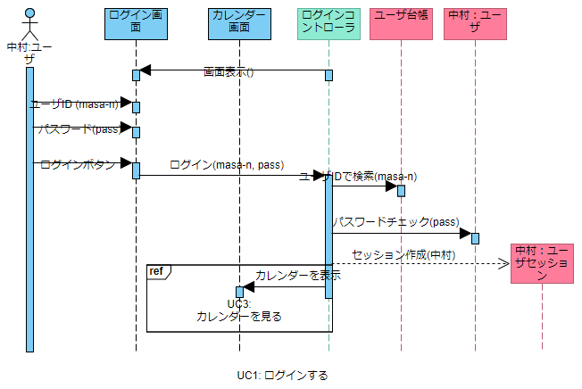
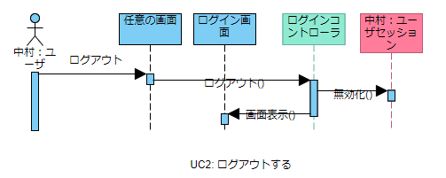
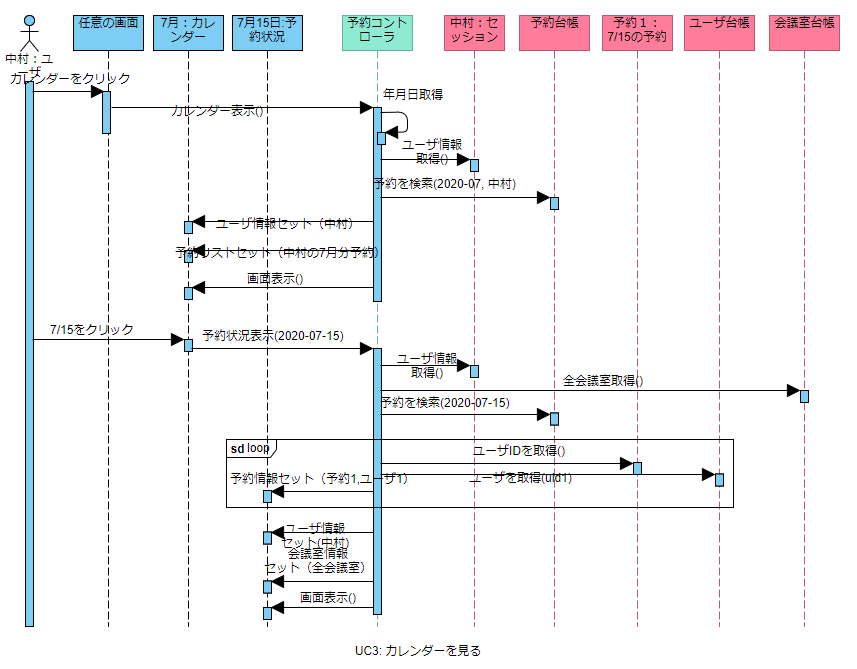
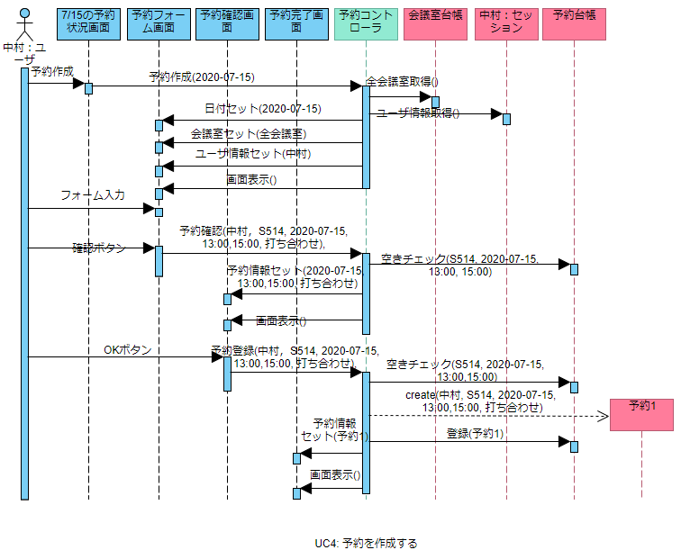
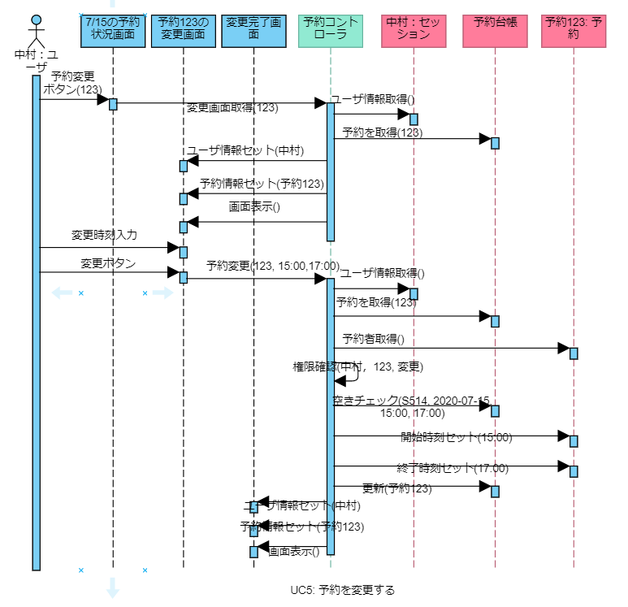
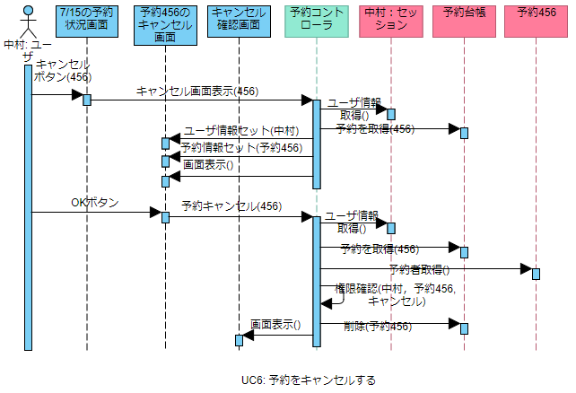

# 会議室予約システム　オブジェクト指向分析

## 参照文書
- [要求仕様書](../requirement/README.md)
- [ユースケース](../usecase/README.md)

## 1. [モノ・コトを発見する](./domain_modeling.md)

## 2. [仕事を発見する](./robustness_analysis.md)
## 3. [仕事を割り当てる](./sequence_analysis.md)

## 4. 成果物

## ドメインモデル図

## 分析レベルのシーケンス図

### UC1: ログインする

### UC2: ログアウトする

### UC3: カレンダーを見る

### UC4: 予約を作成する

### UC5: 予約を変更する

### UC6: 予約をキャンセルする

