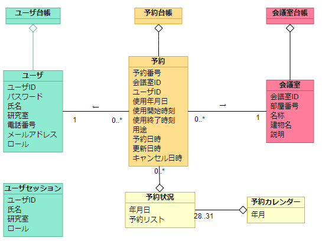

# 会議室予約システム：ドメインモデリング

[戻る](./README.md)

## モノ・コトを発見する
### クラス，属性
- 予約
    - 予約番号
    - 会議室ID
    - ユーザID
    - 使用年月日
    - 開始時刻
    - 終了時刻
    - 使用目的
    - 予約作成日
    - 予約更新日
    - 予約キャンセル日
- ユーザ
    - ユーザID
    - パスワード
    - 氏名
    - 研究室
    - 電話番号
    - メールアドレス
    - ロール（0:管理者，1:教員）
- 会議室
    - 会議室ID
    - 部屋番号
    - 会議室名称
    - 建物名
    - 説明
- カレンダー
    - 年月
    - 日ごとの予約状況
- 予約状況
    - 年月日
    - 予約リスト
- ユーザセッション情報
    - ユーザID
    - 氏名
    - 研究室
    - ロール

### 関連
- 予約 - 参照する -> 会議室
- 予約 - 参照する -> ユーザ

### 台帳系
永続化必要なものは，予約，ユーザ，会議室
- 予約台帳
- ユーザ台帳
- 会議室台帳

### ドメインモデル図

