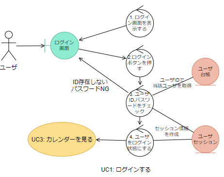
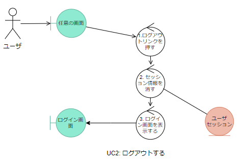
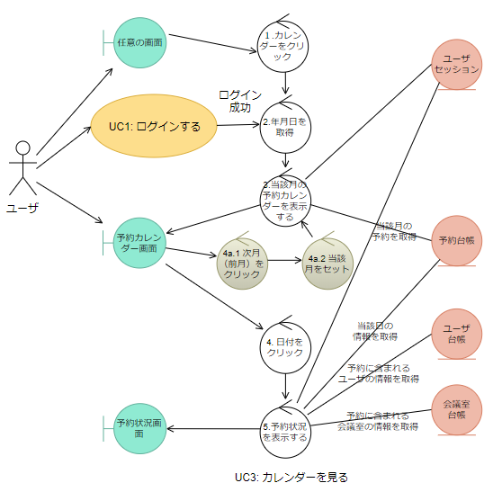
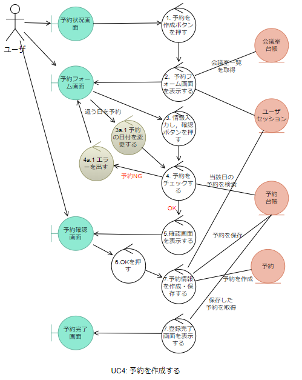
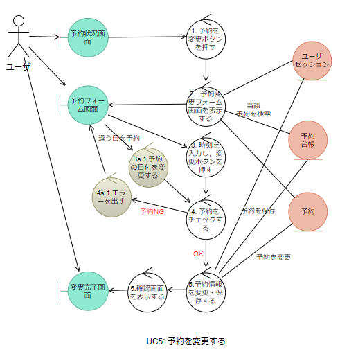
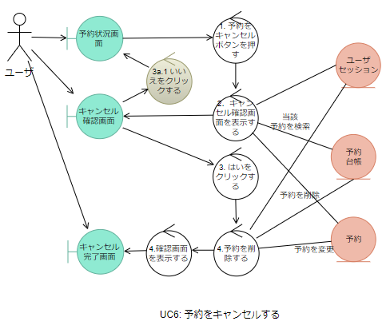

# 会議室予約システム：ロバストネス分析

[戻る](./README.md)

## ユースケース図

## 1. ログインする
- [ユースケース記述](../usecase/usecase01.md)

## 2. ログアウトする
- [ユースケース記述](../usecase/usecase02.md)

## 3. カレンダーを見る
- [ユースケース記述](../usecase/usecase03.md)

## 4. 予約を作成する
- [ユースケース記述](../usecase/usecase04.md)

## 5. 予約を変更する
- [ユースケース記述](../usecase/usecase05.md)

## 6. 予約をキャンセルする
- [ユースケース記述](../usecase/usecase06.md)

