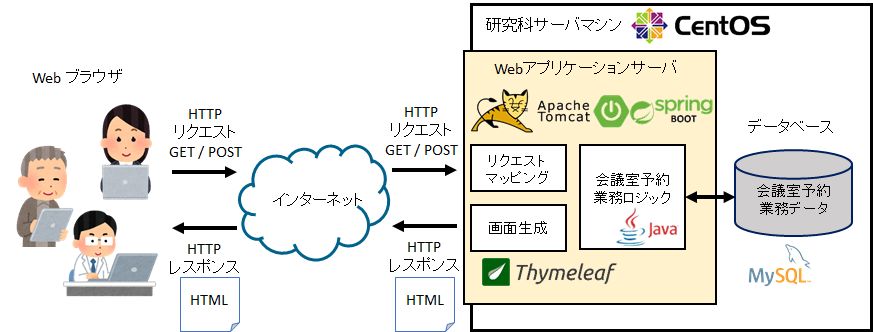
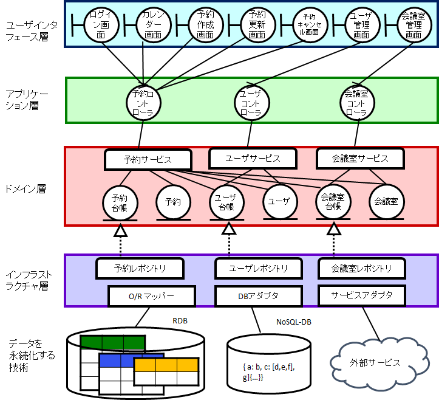
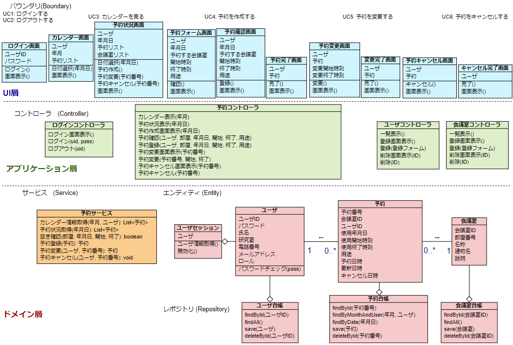

# 会議室予約システム： オブジェクト指向設計

## システム・アーキテクチャ
会議室予約システムのシステムアーキテクチャを下に示す．

[要求仕様書](../requirement/README.md) からWebアプリケーションとして実現することが求められているため，以下の設計選択を行った．
- 研究科に新しくサーバマシンを設置し，Linux (CentOS)をインストール
- サーバマシン上にApache Tomcat Webアプリケーションサーバと，MySQLデータベースサーバをインストール
- 会議室予約システムの業務ロジックはJavaで実装する
- 業務データはMySQLに保存・管理する
- TomcatとJavaの連携は，Spring Bootフレームワークで行う
- 画面についてはテンプレートエンジンThymeleafを使い，サーバ内でHTMLを動的生成する

## ソフトウェア・アーキテクチャ
ソフトウェア・アーキテクチャについては，下図の通り4層アーキテクチャを採用する．

なお，データの永続化は，RDBで行う

## 分析レベルのクラス図
[分析レベルのシーケンス図](../analysys/sequence_analysis.md) を参考に，コントローラ内の会議室予約に関する業務処理をサービスに切り出した．

責務の割り当ては，トランザクション・スクリプトで行った．

また，予約台帳，ユーザ台帳，会議室台帳をレポジトリとして設計した．

上記クラス図をベースに，属性，操作，関連を設計した．

## データ仕様

### ユーザ
- ユーザID： String型．アルファベット小文字，数字，ハイフン，アンダーバーのみを許す．16文字まで．一意にユーザを識別できること
- パスワード： String型．省略不可．8文字以上．
- 氏名： String型．省略不可．32文字まで．
- 研究室： String型．省略可．32文字まで．
- 電話番号： String型． 省略可．数字，ハイフンのみ許す．
- メールアドレス： String型．省略不可．RFC2822のメールフォーマットに準拠すること
- ロール： enum型．TEACHER, ADMIN のいずれか

### 予約
- 予約番号： Long型．連番で一意に予約を識別できること．システムが自動採番
- 会議室ID： Long型．省略不可．会議室エンティティの会議室IDに準ずる
- ユーザID： String型．省略不可．ユーザエンティティのユーザIDに準ずる
- 使用年月日： Date型．省略不可．日付フィールドのみ参照
- 使用開始時刻： Date型．省略不可．時刻フィールドのみ参照
- 使用終了時刻： Date型．省略不可．時刻フィールドのみ参照
- 用途： String型．省略不可．64文字まで．
- 予約日時：Date型 システムが付与
- 更新日時：Date型 システムが付与
- キャンセル日時： Date型 システムが付与

### 会議室
- 会議室ID： Long型．連番で一意に会議室を識別できること
- 部屋番号： String型．省略不可．16文字まで
- 部屋名： String型．省略可能．64文字まで
- 建物名： String型．省略可能．64文字まで
- 説明： String型．省略可能．512文字まで

## 設計レベルのクラス図

以上をまとめて，設計レベルのクラス図を作成した．

補足説明
- バウンダリクラスは，ThymeleafのHTMLテンプレートとして設計している
    - HTMLテンプレートとは，属性（Model Attribute）が変数になっている穴あきのHTML
    - 属性の値は，ユーザがフォームから入力，あるいは，コントローラでセットされる．
    - コントローラが返り値としてHTMLテンプレート名を返せば，Thymeleafが当該テンプレートに属性値を代入して，完全なHTMLにして表示（レンダリング）する
    - テンプレートのメソッドは，アクションを表す．フォーム送信ボタンの押下(POST)やリンクのクリック(GET)に対応する
- 3つのコントローラ（予約，ユーザ，会議室）はサービスを参照している
- ログインコントローラはSpring Securityフレームワークを利用するので，特に自前のサービス層はなし
- 3つのサービスはそれぞれ業務処理に必要なリポジトリを参照している
- エンティティ間の関連は，IDで保持している

