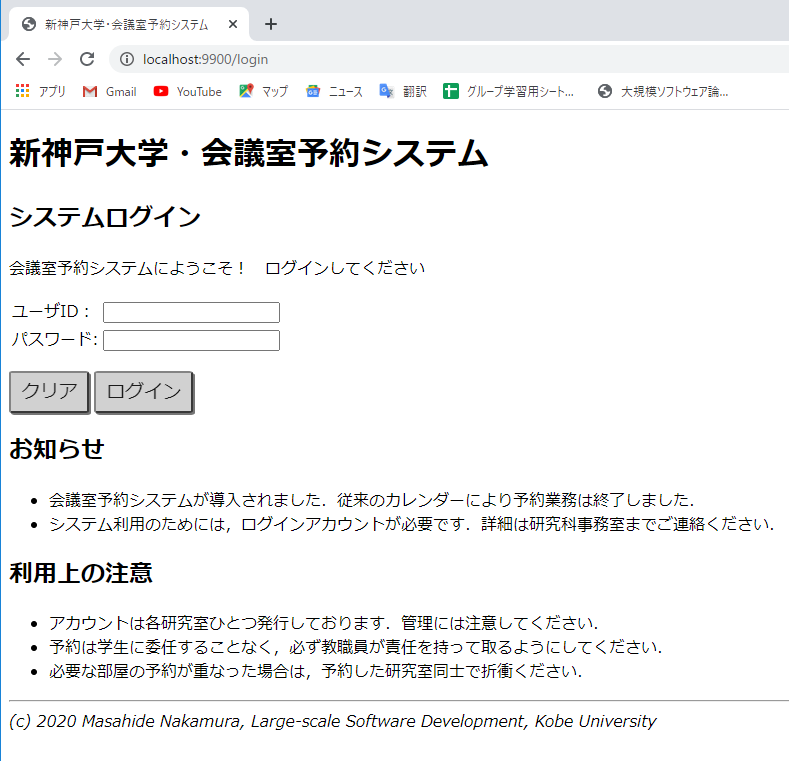
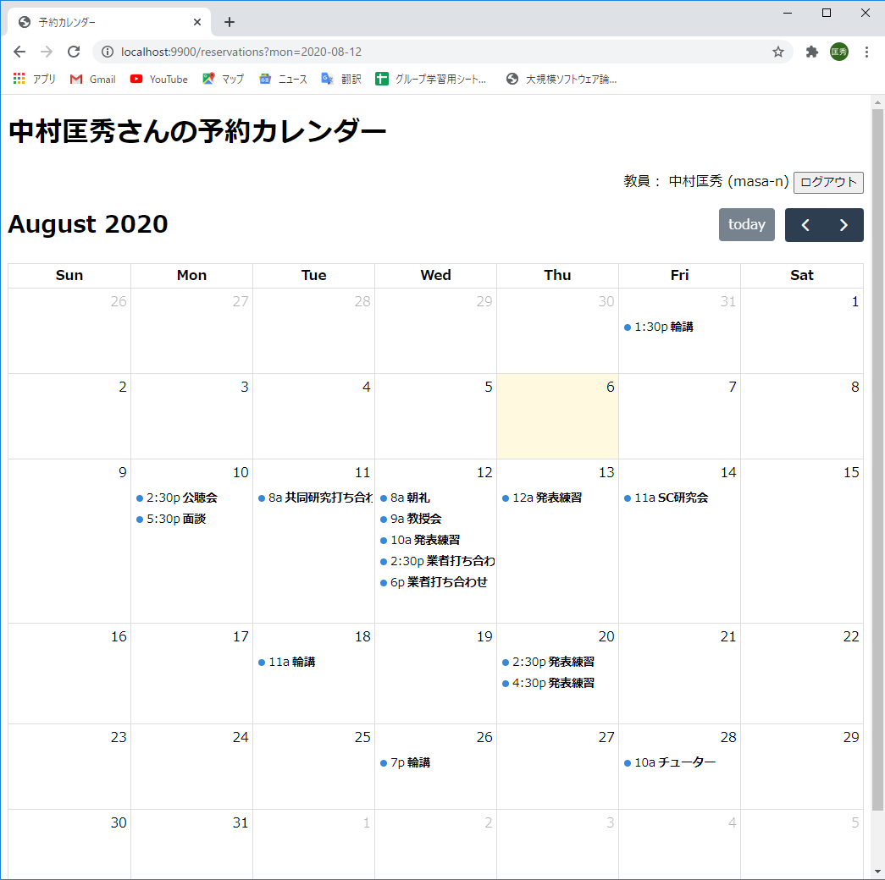
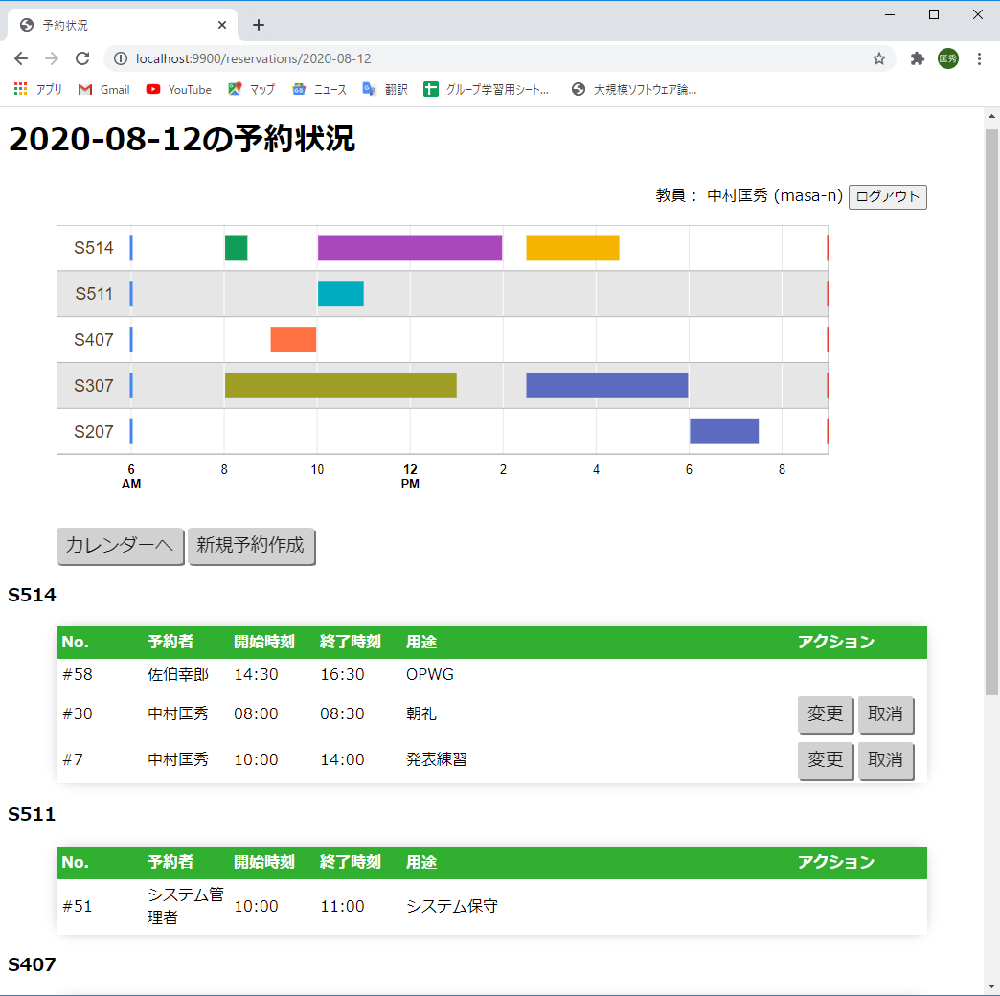
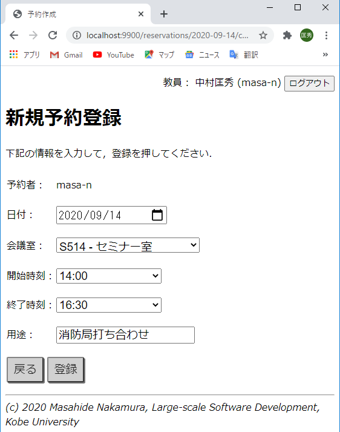
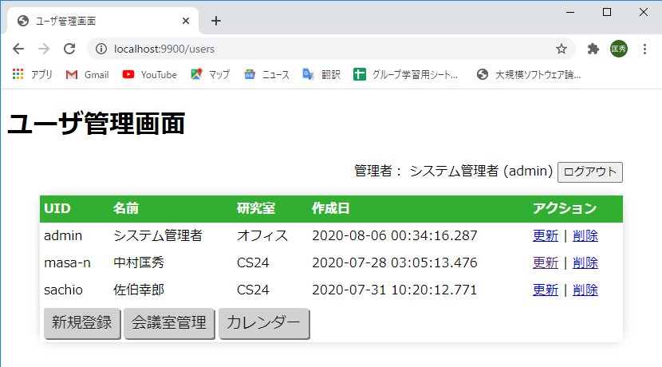
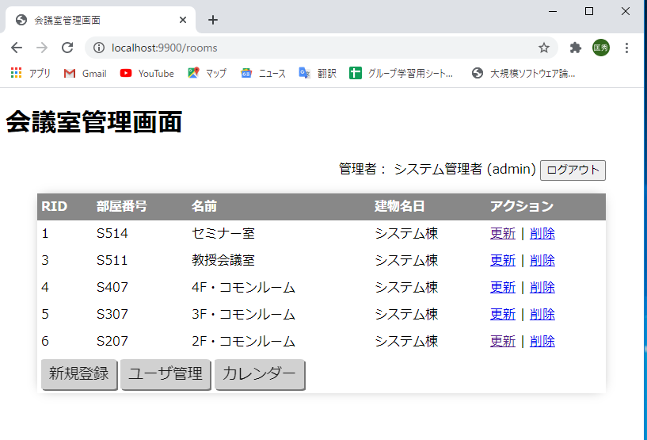

# 会議室予約システム - 実装
2020-08-09 中村

## 概要
- 大規模ソフトウェア論で例題に挙げた [会議室予約システム](../README.md) の参照実装
- 利用技術
    - サーバ側： Spring Boot 2.3.2, Thymeleaf 3.0, Spring Security 5
    - クライアント側： [Fullcalendar.js](https://fullcalendar.io/) 5.2.0 (カレンダー表示)， [Google Chart Timeline](https://developers.google.com/chart/interactive/docs/gallery/timeline) (予約状況表示)
- [10個のユースケース](../usecase/README.md) をすべて実装
    - ロール別の認可機能により，アクセスできるユースケースをコントロール
        - 教員： UC1-6
        - 管理者： UC7-10　（教員権限も持たせることにした）

## 実装上のテクニック
### 確認画面での属性の扱い
- フォームを入力しチェックを経て，確認の画面（完了手前の画面）では，各属性をtype=hiddenでフォーム内に入れておくこと．
    - でないとPOSTした際に渡されない

### Javascriptライブラリとの連携
- 予約カレンダーや予約のガントチャートは，JavaScriptの外部サービス・ライブラリを活用している.
- コントローラで取得したデータを，ライブラリで使いやすい形に変形（適宜DTOを定義する）
- ThymeleafのHTMLテンプレートのJavascriptのコードに，当該データをインラインで展開 (th:inline="javascript")するように指示
- クライアントがページを読み込んだ際に，展開されたデータを外部サービスに渡す

### フラグメントによるHTMLテンプレートの再利用
- ページヘッダ，フッタ，ログアウトボタンなど，全ページに共通して現れるHTMLの部品は，Thymeleafのフラグメント機能を用いて再利用している
- 再利用部品は，parts.html に定義し，各ページから，insert, replaceで差し込んでいる

## 実行方法
1. MySQLに新規データベースmeetingを作成
    - ユーザ： meeting　パスワード：tokuronI に全権委譲 (grant all) すること
1. VS-CodeでMeetingRoomReservationApplication.java をF5で実行
1. http://localhost:9900/ を開く
1. 管理者アカウントでログイン
    - ユーザ： admin   パスワード: secret88
    - 管理者アカウントの設定は，applications.propertiesを参照
1. ユーザ，会議室を適宜登録する
1. 予約を作成してみる

## デプロイ方法

1. VS-Codeでctrl-@ でパワーシェルを起動
1. .\gradlew.bat war でwarを作成 (/build/libs/meeting.war) ができる
1. meeting.war を Tomcatのwebappsにwarコピー
1. http://localhost:8080/meeting/ にアクセス

## 画面

### ログイン画面

- ユーザIDとパスワードを入力して，ログインを押す．

### カレンダー画面

- カレンダーで自分の予約を確認する
- 予約を作成したい日をカレンダーからクリックする

### 予約状況確認画面

- 予約の新規作成，変更，キャンセルを行う

### 予約登録フォーム

- 予約の諸元を入力して登録ボタンを押す

### ユーザ管理画面（管理者）

- 管理者がユーザの追加，更新，削除を行う

### 会議室管理画面（管理者）

- 管理者が会議室の追加，更新，削除を行う

