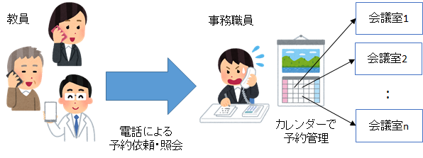
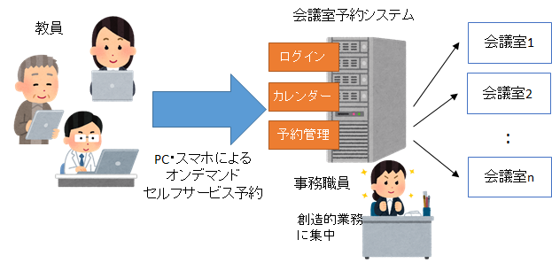

# 会議室予約システム 要求仕様

新神戸大学・システム情報学研究科 
第1版 2020-06-30

## 1. システムの目的

本システムの目的は，新神戸大学システム情報学研究科における会議室の予約管理業務をオンライン化し，研究科の教員が，場所や時間を選ばずに，オンデマンド・セルフサービスで，会議室を予約可能にすることである．

これまで新神戸大学・システム情報学研究科では，研究科で管理する会議室の予約業務を，事務職員が電話で行ってきた．具体的には，教員が使用する会議室，使用日時，使用用途を電話で伝え，事務職員が事務室のカレンダーに書き込んで予約を管理していた．しかしながら，事務職員の負担が大きいこと，アナログのカレンダーでの管理に限界があること，不在時に対応できないこと等の課題があった．

そこで，会議室予約管理を行うシステムをWebアプリケーションとして実装し，教員が自身のPCから，24時間365日，どこからでも，会議室を予約，確認，変更，キャンセルできるようにする．本システムの導入により，事務職員は負担の大きかった電話応対から解放されるとともに，正確で可用性の高い会議室予約業務が達成できる．

## 2. システムの概要
本システムは，研究科における会議室予約業務を，場所や時間を選ばずに，オンデマンド・セルフサービスで行うWebアプリケーションとして構築する．

下図(a)は，システム導入前の現状である．会議室の予約は電話で事務職員に依頼する形になっている．事務職員は，複数の会議室の予約を事務室のカレンダーに書き込んで，手動で管理していた．

 
(a) システム導入前の現状 

下図(b)は，システム導入後のあるべき姿である．会議予約システムは，教員，会議室，予約のデータをシステム内で管理するWebアプリケーションとして実装される．教員は，自身のPCやスマホでWebブラウザを開き，システムにログインして，会議室の予約管理を自分自身で行う．システムは，現状の全ての予約を一覧するカレンダー機能，予約を登録・変更・キャンセルをする予約管理機能を持つ．

 
(b) システム導入による効果

システムの導入によって，教員は時間や場所を選ばずに会議室を予約できるようになる．また，事務職員は電話による予約応対から解放され，他の創造的業務に集中できる．

## 3. 機能一覧

### (1) ユーザ管理機能

システム管理者が教員をシステムのユーザとして登録・管理する機能．

管理する教員の情報は，

- ユーザID
- パスワード
- 氏名
- 研究室
- 電話番号
- メールアドレス

である．

### (2) 会議室管理機能

システム管理者が，管理対象の会議室を登録・管理する機能．

管理する会議室の情報は，

- 会議室ID
- 部屋番号
- 会議室名称
- 建物名
- 説明

である．

### (3) ログイン機能

教員がシステムを利用する際のログインを行う機能．ログインはユーザIDとパスワードで行う．ログインが成功すると，予約カレンダーの閲覧，予約の登録，自身の予約の変更・キャンセルが可能になる．

### (4) カレンダー機能

ログインに成功した教員が，システムに登録されているすべての予約をカレンダーで一覧できる機能．会議室の空き状況を確認し，自身の予約管理に役立てる．

### (5) 予約管理機能

ログインに成功した教員が，

- 予約の作成
- 予約の変更
- 予約のキャンセル

を行う機能．

予約の作成には，
- 使用する会議室
- 使用日
- 開始時刻
- 終了時刻
- 使用目的

を入力する．

なお，予約の変更は，開始・終了時刻のみ可能．予約のキャンセルは，指定した予約を削除する．

## 4. 稼働開始時期

本システムの稼働開始日は，2020年10月1日とする．

## 5. 想定予算

本システムの開発・保守のための予算は，開発費200万円，保守費30万円（年間）とする．

