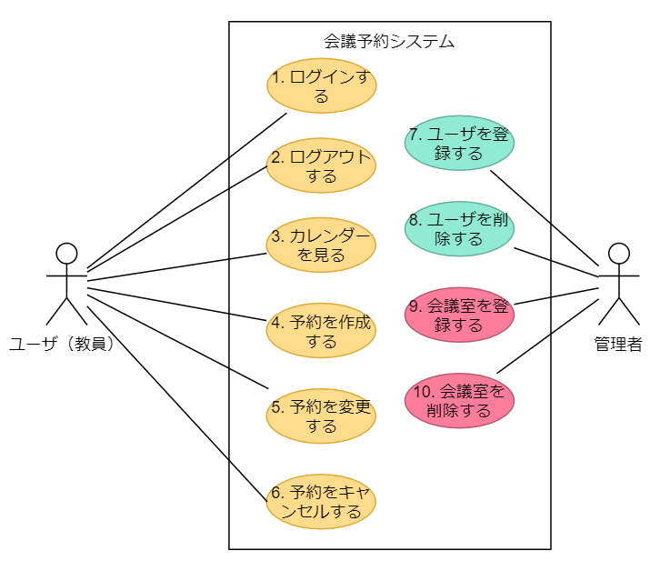

＃ 会議室予約システム　ユースケースモデリング

2020-07-10 中村匡秀

会議予約システムのユースケースモデリングを行う．

## 1. ユースケース図

## 2. ユースケース一覧
### 2.1 ユーザ用ユースケース
1. [ログインする](./usecase01.md)
1. [ログアウトする](./usecase02.md)
1. [カレンダーを見る](./usecase03.md)
1. [予約を作成する](./usecase04.md)
1. [予約を変更する](./usecase05.md)
1. [予約をキャンセルする](./usecase06.md)

### 2.2 管理者用ユースケース

(作成中)

1. [ユーザを登録する](./usecase07.md)
1. [ユーザを削除する](./usecase08.md)
1. [会議室を登録する](./usecase09.md)
1. [会議室を削除する](./usecase10.md)
