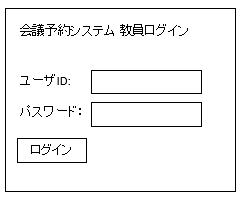

# ユースケース 1： ログインする

## 概要
教員がシステムにログインして，予約管理業務を行う権限を取得する．

## アクター
- 教員

## 事前条件
- システムにログインしていないこと

## 事後条件
- 教員がシステムにログインした状態になる
- システムに予約カレンダー画面が表示された状態になる

## トリガ―
- 教員がシステムの使用を開始する

## 基本フロー
1. システムは，ログイン画面を表示する．
2. 教員は，ユーザIDとパスワードを入力し，ログインを押す．
3. システムは，ユーザIDでユーザ情報を検索し，パスワードが一致するかをチェックする．
4. パスワードが一致すれば，システムはユーザをログイン状態にする．
5. システムは予約カレンダー画面を表示する（ユースケース3）

## 代替フロー
### 代替フロー1
- 3a.1  基本フロー3でユーザIDが存在しない場合，システムはログインエラーを出し，1に戻る．
### 代替フロー2
- 4a.1 基本フロー4でパスワードが一致しない場合，システムはログインエラーを出して，1に戻る．

## GUI紙芝居
### ログイン画面

