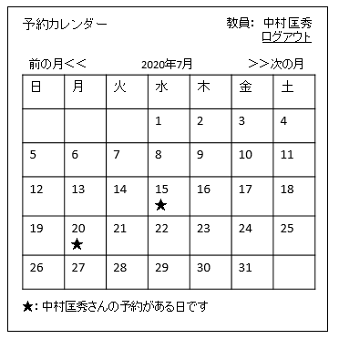
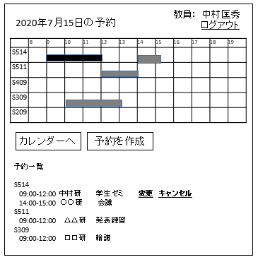

# ユースケース 3： カレンダーを見る

## 概要
ユーザが予約カレンダーを見て，全ての予約を確認する

## アクター
- ユーザ

## 事前条件
- ユーザがシステムにログインしていること

## 事後条件
- ユーザがカレンダーの日ごとの会議室の予約状況を確認できる

## トリガ―
- ユーザがログインに成功する，または，
- ユーザが各画面から，「カレンダー」ボタンを押す

## 基本フロー
1. ユーザがログインに成功する，または，画面から「カレンダー」ボタンを押す．
2. システムは，本日の年月日を取得する．
3. システムは，その月の予約カレンダー画面（UI紙芝居参照）を表示する．ここで，予約カレンダーとは，そのユーザの予約が存在する日に目印がついたカレンダーである．
4. ユーザはカレンダー上の日付をクリックする．
5. システムはその日付（年月日）の予約状況画面（UI紙芝居参照）を表示する．予約状況画面とは，システムが全会議室の予約状況画面を，時刻のガントチャートで表示する．また，システムは，チャートの下に各会議室の予約の詳細をリスト形式で表示する

## 代替フロー
### 代替フロー1
- 4a.1  基本フロー4で，ユーザが別の月の予約を見たい場合には，次の月（または前の月）をクリックする．
- 4a.2  システムは次の月（前の月）のカレンダーを取得し，3に戻る．

## GUI紙芝居
### 予約カレンダー画面

### 予約状況画面

