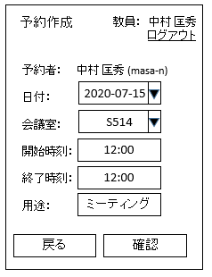
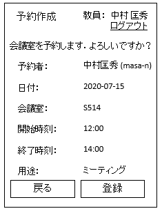

# ユースケース 4： 予約を作成する

## 概要
ユーザが新たに予約を作成する．

## アクター
- ユーザ

## 事前条件
- ユーザが予約状況画面を表示している

## 事後条件
- そのユーザの新たな予約が作成される．

## トリガ―
- ユーザが，予約状況画面で「予約を作成」ボタンを押す

## 基本フロー
1. ユーザが，ある年月日の予約状況画面で「予約を作成」ボタンを押す．
2. システムは，その年月日をセットした予約フォーム画面を表示する．
3. ユーザは，部屋名，開始時刻，終了時刻，用途を入力し，「確認」ボタンを押す
4. システムは，入力された時間帯が，他の予約と重なっていないかチェックする．
5. チェックOKなら，システムは入力情報の確認画面を表示する．
6. ユーザは，OKボタンを押す．
7. システムは，入力された情報に基づいて，予約情報を作成・保存し，登録完了画面を表示する．

## 代替フロー
### 代替フロー1
- 4a.1  基本フロー4において，他の予約と重なっている場合は，エラーを表示し，2に戻る．

### 代替フロー2
- 3a.1  基本フロー3において，その年月日以外の予約を行いたい場合には，日付の変更を行い，「確認」ボタンを押す．4に合流する

## GUI紙芝居
### 予約フォーム画面

### 入力確認画面

