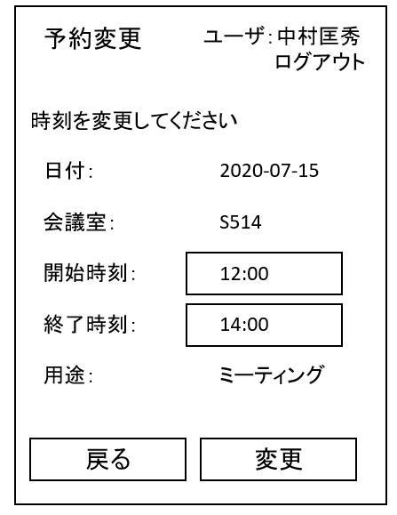

# ユースケース 5： 予約を変更する

## 概要
ユーザが，自分の既存の予約の開始時刻・終了時刻を変更する．

## アクター
- ユーザ

## 事前条件
- ユーザが予約状況画面を表示している

## 事後条件
- そのユーザの予約の開始時刻，終了時刻が変更される．

## トリガ―
- ユーザが，予約状況画面で「予約を変更」ボタンを押す

## 基本フロー
1. ユーザが，ある年月日の予約状況画面で「予約を変更」ボタンを押す．
2. システムは，その予約の変更フォーム画面を表示する．
3. ユーザは，新しい開始時刻，終了時刻を入力し，変更ボタンを押す．
4. システムは，新しい時間帯が，他の予約と重なっていないかチェックする．
5. チェックOKなら，システムは予約情報を変更し，システムに保存，変更完了画面を表示する．

## 代替フロー
### 代替フロー1
- 3a.1  基本フロー4において，他の予約と重なっていた場合，エラーを表示し，2に戻る．

## GUI紙芝居
### 予約変更フォーム画面

