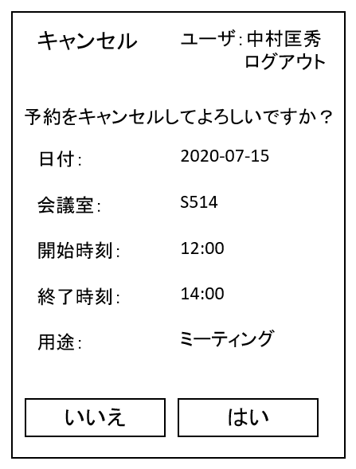

# ユースケース 6： 予約をキャンセルする

## 概要
教員が，自分の既存の予約をキャンセルする．

## アクター
- 教員

## 事前条件
- 教員が予約状況画面を表示している

## 事後条件
- その教員の予約がキャンセルされる

## トリガ―
- 教員が，予約状況画面で「キャンセル」ボタンを押す

## 基本フロー
1. 教員が，ある年月日の予約状況画面で「キャンセル」ボタンを押す．
2. システムは，予約キャンセルの確認画面を表示する．
3. 教員は，はいを押す．
4. システムは，予約情報を消去し，キャンセル完了画面を表示する．

## 代替フロー
### 代替フロー1
- 3a.1  基本フロー3において，教員がいいえを押すと，システムは予約状況画面に戻る

## GUI紙芝居
### 予約変更フォーム画面

